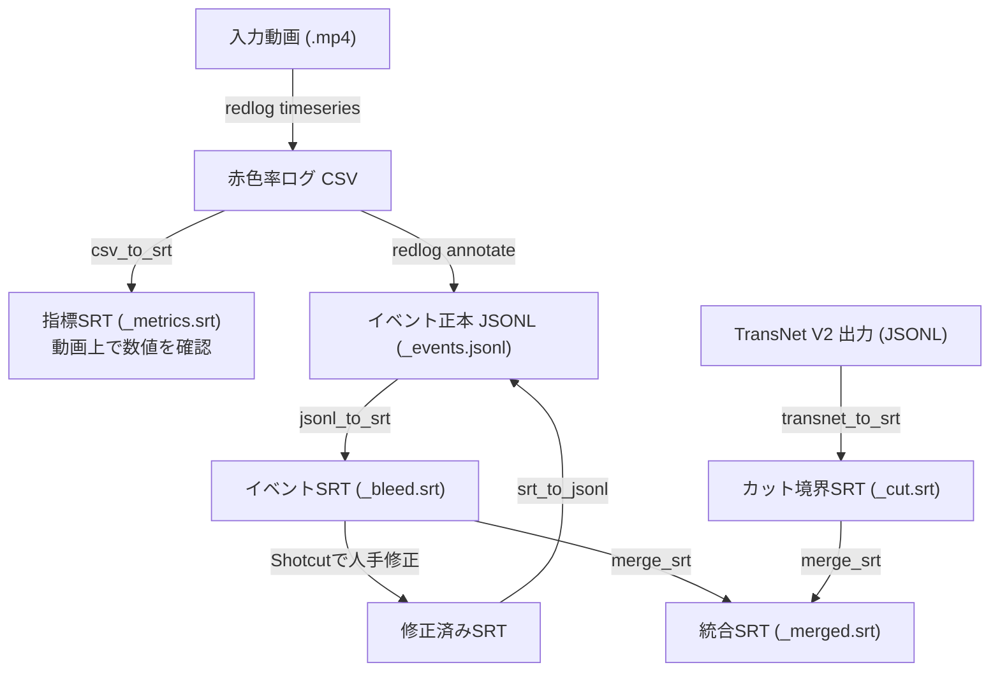

# Video Image Analyzer — AIエージェント向けシステムサマリー

> このドキュメントは、AIエージェント（研究支援・コード生成・分析評価）にシステムの全体像と仕様を伝えるためのものである。

## 1. システム概要

**目的**: 腹腔鏡手術動画を解析し、イベント（出血候補・カット境界など）をSRT字幕ファイルとして出力する。Shotcutで可視化し、人手による確認・修正を経て高品質なアノテーションデータを構築する。

**設計思想**:
- **JSONL正本（Single Source of Truth）**: 全イベントデータはJSONLで管理。SRTは可視化・編集用のビューにすぎない。
- **2段階分離**: 時系列記録（動画→CSV）とイベント検出（CSV→JSONL/SRT）を分離し、閾値調整の反復を高速化。
- **Human-in-the-loop**: アルゴリズム出力をShotcutで修正し、修正結果をJSONLにフィードバック。

## 2. データフロー



## 3. データフォーマット定義

### 3.1 JSONL（イベント正本）

ファイル名: `{stem}_events.jsonl`

```json
{
  "type": "bleed_candidate",
  "metric": "red_ratio",
  "thr": 0.03,
  "k_s": 3.0,
  "smooth_s": 5.0,
  "delta_max": 0.051234,
  "start_sec": 135.6,
  "end_sec": 138.8,
  "start_srt": "00:02:15,600",
  "end_srt": "00:02:18,800"
}
```

| フィールド | 型 | 必須 | 説明 |
|---|---|---|---|
| `type` | string | ✅ | イベント種別 (`bleed_candidate`, `cut`) |
| `start_sec` | float | ✅ | 開始時刻（秒） |
| `end_sec` | float | ✅ | 終了時刻（秒） |
| `metric` | string | | 検出指標 |
| `thr` | float | | 使用した閾値 |
| `k_s` | float | | 連続条件（秒） |
| `smooth_s` | float | | 平滑化窓（秒） |
| `delta_max` | float | | 区間内の最大変化量 |

### 3.2 SRT（可視化・編集用）

**イベントSRT** (`_bleed.srt`): 2行構造

```srt
1
00:02:15,600 --> 00:02:18,800
[bleed] delta_over_threshold
{"type": "bleed_candidate", "metric": "red_ratio", "thr": 0.03, "delta_max": 0.05}
```

- 3行目: 人間用タグ（`[bleed]`, `[cut]`）
- 4行目: 機械用JSON（時刻情報を除外）
- **SRTの時刻が正**。JSON行の時刻情報は無視される。

**指標SRT** (`_metrics.srt`): CSV数値の可視化

```srt
1
00:00:00,000 --> 00:00:00,200
red=0.0123 Δs=0.0000
```

### 3.3 CSV（時系列ログ）

ファイル名: `{stem}_redlog.csv`

| 列名 | 型 | 説明 |
|---|---|---|
| `t_sec` | float | 経過秒数 |
| `t_srt` | string | SRT形式時刻 |
| `red_ratio` | float | 赤色率（0.0〜1.0） |
| `delta` | float | 前フレームからの増加量 |
| `smooth_delta` | float | deltaの移動平均 |
| `reader` | string | バックエンド（pyav/opencv） |

## 4. モジュールAPIリファレンス

### 4.1 `src.red.redlog` — 赤色解析

**アルゴリズム**: HSV色空間で赤色（H∈[0,10]∪[170,179]、S≥s_min、V≥v_min）の面積比を計算。円形ROIで腹腔鏡外周を除外。PyAV（PTSベース）優先、OpenCVフォールバック。

#### `record_timeseries(video_path, outdir, fps=5.0, s_min=60, v_min=40, roi_margin=0.08, no_roi=False, smooth_s=5.0) → dict`

動画をサンプリングしてCSVを出力する（Step 1）。イベント検出は行わない。

#### `annotate_bleed(csv_path, outdir, thr=0.03, k_s=3.0, smooth_s=5.0) → dict`

CSVから閾値ベースでイベントを抽出し、JSONL/SRTを出力する（Step 2）。動画の再読み込み不要。

#### `analyze_video(video_path, outdir, ...) → dict`

`record_timeseries` + `annotate_bleed` の一括実行（後方互換）。

#### 公開ユーティリティ

| 関数 | シグネチャ | 説明 |
|---|---|---|
| `compute_red_ratio` | `(frame_bgr, roi_mask, s_min=60, v_min=40) → float` | 1フレームの赤色率 |
| `make_circular_roi` | `(height, width, margin=0.08) → np.ndarray` | 円形ROIマスク |
| `smooth_center` | `(values, window) → List[float]` | 中心移動平均 |
| `extract_bleed_events` | `(times, smooth_deltas, thr, k_s, fps, smooth_s) → List[dict]` | イベント抽出 |
| `iter_frames` | `(video_path, fps) → Generator[(t_sec, bgr, reader)]` | フレーム読取 |

### 4.2 `src.transnet.transnet_to_srt` — TransNet境界変換

TransNetV2の境界JSONL（`{"t_sec": float, "score": float}`）をSRTに変換。

#### `convert(in_jsonl, out_srt, pad_ms=100) → int`

各境界点を `t_sec ± pad_ms` の短いSRTエントリに変換する。

### 4.3 `src.tools.csv_to_srt` — CSV → SRT変換

#### `convert(in_csv, out_srt, columns=None) → int`

CSVの数値列をSRT字幕に変換する。`columns` でデフォルト `["red_ratio", "smooth_delta"]`。

### 4.4 `src.tools.jsonl_to_srt` — JSONL → SRT変換

#### `convert(in_jsonl, out_srt, event_type=None) → int`

イベントJSONLからSRTを生成。`event_type` で特定種別のみフィルタ可能。

### 4.5 `src.tools.srt_to_jsonl` — SRT → JSONL変換

#### `convert(in_srt, out_jsonl) → int`

Shotcutで編集済みのSRTを読み込み、JSONL正本に変換する。SRTの時刻でJSON内の時刻を上書きする。

### 4.6 `src.tools.merge_srt` — SRTマージ

#### `merge(out_path, srt_paths) → int`

複数SRTを時刻順にマージし、インデックスを振り直す。

## 5. CLIリファレンス

```bash
# Step 1: 時系列記録
python -m src.red.redlog timeseries --video INPUT.mp4 --outdir OUT/

# Step 2: 出血アノテーション
python -m src.red.redlog annotate --csv OUT/INPUT_redlog.csv --outdir OUT/ --thr 0.03

# 一括実行
python -m src.red.redlog analyze --video INPUT.mp4 --outdir OUT/

# CSV → 指標SRT
python -m src.tools.csv_to_srt --in-csv OUT/INPUT_redlog.csv --out-srt OUT/INPUT_metrics.srt

# TransNet → SRT
python -m src.transnet.transnet_to_srt --in-jsonl boundaries.jsonl --out-srt OUT/cut.srt

# JSONL ⇔ SRT
python -m src.tools.jsonl_to_srt --in-jsonl events.jsonl --out-srt bleed.srt
python -m src.tools.srt_to_jsonl --in-srt bleed_edited.srt --out-jsonl events_updated.jsonl

# SRTマージ
python -m src.tools.merge_srt --out merged.srt cut.srt bleed.srt
```

## 6. 新規分析器の追加ガイド（コードエージェント向け）

新しい分析器（例: ポート検出、器具認識）を追加する手順:

### 6.1 ディレクトリ構造

```
src/
├── red/           # 既存: 赤色解析
├── transnet/      # 既存: TransNet連携
├── {new_analyzer}/  # 新規分析器
│   ├── __init__.py
│   └── {analyzer_name}.py
└── tools/         # 既存: 変換ツール（共通利用）
```

### 6.2 実装パターン

既存の `redlog.py` に倣い、以下の2段階構成を推奨する:

```python
# Step 1: 時系列記録
def record_timeseries(video_path: str, outdir: str, **params) -> dict:
    """動画 → CSV（サンプリング結果の保存）"""
    ...
    return {"csv": str(csv_path)}

# Step 2: イベントアノテーション
def annotate(csv_path: str, outdir: str, **params) -> dict:
    """CSV → JSONL + SRT（閾値ベースのイベント検出）"""
    ...
    return {"jsonl": str(jsonl_path), "srt": str(srt_path)}
```

### 6.3 JSONL出力規約

新規イベントタイプを追加する場合:

1. `type` フィールドに一意の識別子を設定（例: `"port_in"`, `"instrument_detected"`）
2. `start_sec`, `end_sec` フィールドは必須
3. イベント固有のメタデータは自由に追加可能

### 6.4 SRTタグの登録

`src/tools/jsonl_to_srt.py` の `TAG_TEMPLATES` に新しいタグを追加する:

```python
TAG_TEMPLATES = {
    "bleed_candidate": "[bleed] delta_over_threshold",
    "cut": "[cut] transnet",
    "port_in": "[port] intrabody",        # 新規追加
}
```

同様に `src/tools/srt_to_jsonl.py` の `TAG_PATTERNS` にも追加する。

### 6.5 テスト

`tests/test_{analyzer_name}.py` を作成し、以下を最低限テストする:
- 時系列記録の出力CSVフォーマット
- イベント抽出ロジック（正常系・境界値・空入力）
- JSONL/SRT出力の整合性

## 7. 依存ライブラリ

| パッケージ | 用途 |
|---|---|
| `opencv-python` | フレーム読込・HSV変換・赤色マスク計算 |
| `numpy` | 画像配列操作・ROIマスク生成 |
| `av` (PyAV) | PTSベースのフレーム読込（VFR動画対応） |

## 8. 拡張予定

- `port` / `intrabody` / `extrabody` 状態推定
  - v0: OpenCVベース特徴量
  - v1: AI分類器（CNN/ViT）
