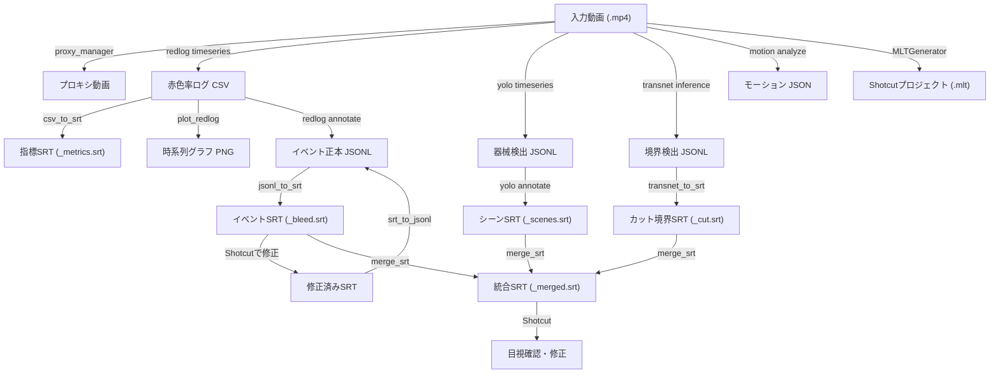

# Video Data Analyser — AIエージェント向けシステムサマリー

> このドキュメントは、AIエージェント（研究支援・コード生成・分析評価）にシステムの全体像と仕様を伝えるためのものである。

## 1. システム概要

**目的**: 腹腔鏡手術動画を複数の解析エンジンで分析し、イベント（出血候補・カット境界・器械変化など）をSRT字幕/MLTプロジェクトとして出力する。Shotcutで可視化し、Human-in-the-loop で修正を経て高品質なアノテーションデータを構築する。

**設計思想**:
- **JSONL正本（Single Source of Truth）**: 全イベントデータはJSONLで管理。SRTは可視化・編集用のビューにすぎない。
- **2段階分離**: 時系列記録（動画→CSV）とイベント検出（CSV→JSONL/SRT）を分離し、閾値調整の反復を高速化。
- **Human-in-the-loop**: アルゴリズム出力をShotcutで修正し、修正結果をJSONLにフィードバック。
- **PTSベース**: VFR動画でも安定するようPyAV（PTS基準）でフレーム時刻を取得。

**環境管理**: `uv`（`pyproject.toml`）

## 2. ディレクトリ構成

```
video_data_analyser/
├── pyproject.toml           # uv用依存関係定義
├── src/
│   ├── core/                # 共通ユーティリティ
│   │   └── time_utils.py    #   SRT/MLT時刻フォーマット（全モジュール共通）
│   ├── analyzers/           # 解析器の基底クラス
│   │   └── base.py          #   BaseAnalyzer / AnalysisResult
│   ├── red/                 # 赤色（出血）解析 ── 3アルゴリズム
│   │   ├── redlog.py        #   HSV赤色率 時系列記録＋閾値イベント抽出
│   │   ├── bleed_detector.py #   赤色拡大検出（フレーム差分ベース）
│   │   └── bleed_spread.py  #   グリッドベース局所拡散検出
│   ├── transnet/            # TransNetV2 シーン検出
│   │   ├── inference.py     #   TransNetV2 PyTorchモデル推論
│   │   ├── transnet_analyzer.py # BaseAnalyzerインターフェース
│   │   └── transnet_to_srt.py   # 境界JSONL→SRT変換
│   ├── motion/              # モーション検出
│   │   └── motion_analyzer.py #  フレーム差分ベース動き検出
│   ├── yolo/                # YOLO器械検出
│   │   └── yolo_analyzer.py #   YOLO8手術器械認識＋シーン分割
│   ├── mlt/                 # Shotcut MLTプロジェクト生成
│   │   ├── mlt_generator.py #   MLT XML生成（マルチトラック対応）
│   │   └── mlt_builder.py   #   設定ベースMLTビルダー
│   ├── tools/               # 変換・ユーティリティ
│   │   ├── proxy_manager.py #   プロキシ動画の作成・管理
│   │   ├── jsonl_to_srt.py  #   JSONL → SRT
│   │   ├── srt_to_jsonl.py  #   SRT → JSONL（編集反映）
│   │   ├── merge_srt.py     #   複数SRTマージ
│   │   ├── csv_to_srt.py    #   CSV時系列 → SRT字幕
│   │   └── plot_redlog.py   #   CSV → PNGグラフ
│   └── pipeline.py          # 統合パイプライン（プロキシ→解析→MLT）
├── tests/                   # ユニットテスト（102件）
└── docs/
    └── ai_agent_summary.md  # 本書
```

## 3. データフロー


```mermaid
graph TD
    Video["入力動画 (.mp4)"] -->|"proxy_manager"| Proxy["プロキシ動画"]
    Video -->|"redlog timeseries"| CSV["赤色率ログ CSV"]
    Video -->|"yolo timeseries"| YoloJSONL["器械検出 JSONL"]
    Video -->|"transnet inference"| TransJSONL["境界検出 JSONL"]
    Video -->|"motion analyze"| MotionJSON["モーション JSON"]

    CSV -->|"csv_to_srt"| MetricsSRT["指標SRT (_metrics.srt)"]
    CSV -->|"plot_redlog"| Plot["時系列グラフ PNG"]
    CSV -->|"redlog annotate"| JSONL["イベント正本 JSONL"]

    YoloJSONL -->|"yolo annotate"| ScenesSRT["シーンSRT (_scenes.srt)"]
    TransJSONL -->|"transnet_to_srt"| CutSRT["カット境界SRT (_cut.srt)"]

    JSONL -->|"jsonl_to_srt"| EventSRT["イベントSRT (_bleed.srt)"]
    EventSRT -->|"Shotcutで修正"| EditedSRT["修正済みSRT"]
    EditedSRT -->|"srt_to_jsonl"| JSONL

    EventSRT -->|"merge_srt"| MergedSRT["統合SRT (_merged.srt)"]
    CutSRT -->|"merge_srt"| MergedSRT
    ScenesSRT -->|"merge_srt"| MergedSRT

    MergedSRT -->|"Shotcut"| Review["目視確認・修正"]
    Video -->|"MLTGenerator"| MLT["Shotcutプロジェクト (.mlt)"]
```

## 4. データフォーマット定義

### 4.1 JSONL（イベント正本）

ファイル名: `{stem}_events.jsonl`

```json
{
  "type": "bleed_candidate",
  "metric": "red_ratio",
  "thr": 0.03,
  "k_s": 3.0,
  "smooth_s": 5.0,
  "delta_max": 0.051234,
  "start_sec": 135.6,
  "end_sec": 138.8,
  "start_srt": "00:02:15,600",
  "end_srt": "00:02:18,800"
}
```

| フィールド | 型 | 必須 | 説明 |
|---|---|---|---|
| `type` | string | ✅ | イベント種別 (`bleed_candidate`, `cut`, `instrument_scene`) |
| `start_sec` | float | ✅ | 開始時刻（秒） |
| `end_sec` | float | ✅ | 終了時刻（秒） |
| `metric` | string | | 検出指標 |
| `thr` | float | | 使用した閾値 |
| `delta_max` | float | | 区間内の最大変化量 |

### 4.2 SRT（可視化・編集用）

2行構造で統一:

```srt
1
00:02:15,600 --> 00:02:18,800
[bleed] delta_over_threshold
{"type": "bleed_candidate", "metric": "red_ratio", "thr": 0.03, "delta_max": 0.05}
```

- 3行目: 人間用タグ（`[bleed]`, `[cut]`, `[scene]`）
- 4行目: 機械用JSON（時刻情報を除外）
- **SRTの時刻が正**。JSON行の時刻情報は無視される。

### 4.3 CSV（時系列ログ）

3種類のCSVフォーマット:

| ファイル名 | 固有列 |
|---|---|
| `{stem}_redlog.csv` | `red_ratio`, `delta`, `smooth_delta` |
| `{stem}_bleedlog.csv` | `red_ratio`, `newly_red_ratio`, `bg_stability`, `red_expansion`, `smooth_expansion` |
| `{stem}_spreadlog.csv` | `red_ratio`, `max_cell_delta`, `delta_std`, `spread_score`, `smooth_spread`, `n_rising_cells` |

共通列: `t_sec`, `t_srt`, `reader`

## 5. モジュールAPIリファレンス

### 5.1 共通時刻ユーティリティ (`src.core.time_utils`)

全モジュールで共通利用。直接定義せず、必ずこのモジュールからimportすること。

| 関数 | シグネチャ | 説明 |
|---|---|---|
| `format_srt_time` | `(seconds: float) → str` | 秒 → `HH:MM:SS,mmm` |
| `parse_srt_time` | `(time_str: str) → float` | `HH:MM:SS,mmm` → 秒 |
| `format_mlt_time` | `(seconds: float) → str` | 秒 → `HH:MM:SS.mmm` |
| `seconds_to_frames` | `(seconds: float, fps: float) → int` | 秒 → フレーム番号 |
| `frames_to_seconds` | `(frame: int, fps: float) → float` | フレーム番号 → 秒 |

### 5.2 解析器基底クラス (`src.analyzers.base`)

TransNet / Motion / YOLO の解析器が継承する基底クラス。

```python
class BaseAnalyzer(ABC):
    def analyze(self, video_path: str, **params) -> AnalysisResult: ...
    def analyze_and_save(self, video_path, output_json=None, output_csv=None, **params): ...
    def _get_video_info(self, video_path: str) -> Dict: ...  # ffprobe経由

@dataclass
class AnalysisResult:
    analyzer_type: str
    analyzer_version: str
    parameters: Dict[str, Any]
    video_info: Dict[str, Any]
    results: List[Dict[str, Any]]
    metadata: Dict[str, Any]
    def save_json(self, output_path: str): ...
    def save_csv_summary(self, output_path: str): ...
```

### 5.3 赤色解析 (`src.red.redlog`)

**アルゴリズム**: HSV色空間で赤色（H∈[0,10]∪[170,179]、S≥s_min、V≥v_min）の面積比を計算。円形ROIで腹腔鏡外周を除外。PyAV（PTSベース）優先、OpenCVフォールバック。

| 関数 | 説明 |
|---|---|
| `record_timeseries(video_path, outdir, fps=5.0, ...)` | 動画 → CSV（Step 1） |
| `annotate_bleed(csv_path, outdir, thr=0.03, ...)` | CSV → JSONL/SRT（Step 2） |
| `analyze_video(video_path, outdir, ...)` | Step 1 + 2 一括実行 |
| `compute_red_ratio(frame_bgr, roi_mask, ...)` | 1フレームの赤色率 |
| `make_circular_roi(height, width, margin)` | 円形ROIマスク |
| `iter_frames(video_path, fps)` | フレーム読取ジェネレータ |

### 5.4 赤色拡大検出 (`src.red.bleed_detector`)

フレーム間の新規赤色ピクセルを追跡。背景安定度を考慮し、カメラ移動との誤検知を抑制。

### 5.5 局所拡散検出 (`src.red.bleed_spread`)

8×8グリッドでセル単位の赤色率変化を計算。`spread_score = delta_std × max_cell_delta` により局所変化を検出。

### 5.6 TransNet (`src.transnet`)

- `inference.SceneDetector`: TransNetV2 PyTorchモデルラッパー
- `transnet_analyzer.TransNetAnalyzer(BaseAnalyzer)`: プラグイン型インターフェース
- `transnet_to_srt.convert(in_jsonl, out_srt, pad_ms=100)`: 境界JSONL → SRT

### 5.7 モーション検出 (`src.motion.motion_analyzer`)

`MotionAnalyzer(BaseAnalyzer)`: OpenCVフレーム差分＋ガウシアンブラーで動きを検出。

### 5.8 YOLO器械検出 (`src.yolo.yolo_analyzer`)

YOLO8で手術器械を検出し、器械の組み合わせ変化でシーンを分割。手術フェーズ（dissection, cutting, manipulation, neutral）を推定。

### 5.9 MLT生成 (`src.mlt`)

- `MLTGenerator`: Shotcut互換のMLT XML生成（マルチトラック・シリーズ対応）
- `MLTBuilder`: 設定ベースの柔軟なMLTビルダー

### 5.10 変換ツール (`src.tools`)

| モジュール | 機能 |
|---|---|
| `jsonl_to_srt` | JSONL → SRT（`event_type` でフィルタ可能） |
| `srt_to_jsonl` | SRT → JSONL（SRTの時刻でJSONを上書き） |
| `csv_to_srt` | CSV数値 → SRT字幕 |
| `merge_srt` | 複数SRTを時刻順マージ |
| `plot_redlog` | CSV → PNGグラフ（3種類のCSVを自動判別） |
| `proxy_manager` | プロキシ動画の作成・管理（360p/480p/720p/1080p） |

## 6. CLIリファレンス

```bash
# 赤色解析
python -m src.red.redlog timeseries --video IN.mp4 --outdir OUT/
python -m src.red.redlog annotate --csv OUT/IN_redlog.csv --outdir OUT/ --thr 0.03
python -m src.red.redlog analyze --video IN.mp4 --outdir OUT/

# 赤色拡大検出
python -m src.red.bleed_detector timeseries --video IN.mp4 --outdir OUT/
python -m src.red.bleed_detector annotate --csv OUT/IN_bleedlog.csv --outdir OUT/ --thr 0.005

# 局所拡散検出
python -m src.red.bleed_spread timeseries --video IN.mp4 --outdir OUT/
python -m src.red.bleed_spread annotate --csv OUT/IN_spreadlog.csv --outdir OUT/ --thr 0.001

# YOLO器械検出
python -m src.yolo.yolo_analyzer timeseries --video IN.mp4 --outdir OUT/
python -m src.yolo.yolo_analyzer annotate --jsonl OUT/IN_yolo_timeseries.jsonl --outdir OUT/

# TransNet境界変換
python -m src.transnet.transnet_to_srt --in-jsonl boundaries.jsonl --out-srt OUT/cut.srt

# 変換ツール
python -m src.tools.csv_to_srt --in-csv OUT/IN_redlog.csv --out-srt OUT/IN_metrics.srt
python -m src.tools.plot_redlog --in-csv OUT/IN_redlog.csv --out-png OUT/IN_plot.png --thr 0.03
python -m src.tools.jsonl_to_srt --in-jsonl events.jsonl --out-srt bleed.srt
python -m src.tools.srt_to_jsonl --in-srt bleed_edited.srt --out-jsonl events_updated.jsonl
python -m src.tools.merge_srt --out merged.srt cut.srt bleed.srt
```

## 7. 新規分析器の追加ガイド

新しい分析器（例: ポート検出、組織認識）を追加する手順:

### 7.1 方法A: 2段階パターン（redlog準拠）

`src/{new_module}/` に以下の構造で実装する:

```python
from src.core.time_utils import format_srt_time

def record_timeseries(video_path: str, outdir: str, **params) -> dict:
    """動画 → CSV（Step 1）"""
    ...

def annotate(csv_path: str, outdir: str, **params) -> dict:
    """CSV → JSONL + SRT（Step 2）"""
    ...
```

### 7.2 方法B: BaseAnalyzerパターン（TransNet/Motion準拠）

```python
from src.analyzers.base import BaseAnalyzer, AnalysisResult

class NewAnalyzer(BaseAnalyzer):
    def __init__(self):
        super().__init__(name="new_analyzer", version="1.0.0")

    def analyze(self, video_path: str, **params) -> AnalysisResult:
        video_info = self._get_video_info(video_path)
        ...
        return AnalysisResult(
            analyzer_type=self.name,
            analyzer_version=self.version,
            parameters=params,
            video_info=video_info,
            results=results,
        )
```

### 7.3 SRTタグの登録

`src/tools/jsonl_to_srt.py` の `TAG_TEMPLATES` と `src/tools/srt_to_jsonl.py` の `TAG_PATTERNS` に新しいタグを追加する。

### 7.4 テスト

`tests/test_{module_name}.py` を作成し、以下を最低限テストする:
- 時系列記録の出力CSVフォーマット
- イベント抽出ロジック（正常系・境界値・空入力）
- JSONL/SRT出力の整合性

## 8. 依存ライブラリ

| パッケージ | 用途 |
|---|---|
| `opencv-python` | フレーム読込・HSV変換・赤色マスク計算・モーション検出 |
| `numpy` | 画像配列操作・ROIマスク生成 |
| `av` (PyAV) | PTSベースのフレーム読込（VFR動画対応） |
| `matplotlib` | 時系列グラフ描画 |
| `ultralytics` | YOLO8物体検出 |
| `torch` / `torchvision` | TransNetV2推論 |
| `pillow` | 画像処理補助 |
| `pyyaml` | 設定ファイル読込 |
| `ffmpeg-python` | 動画メタデータ取得・プロキシ作成 |
